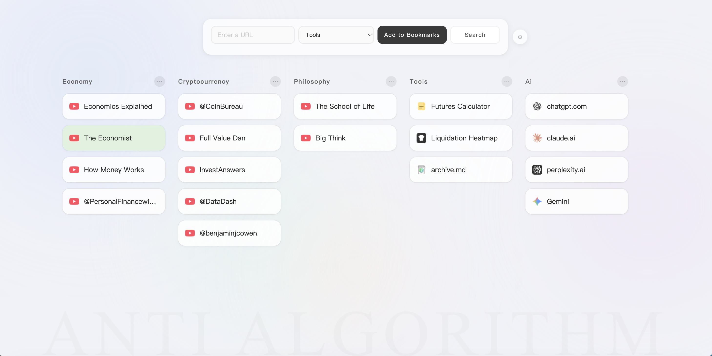
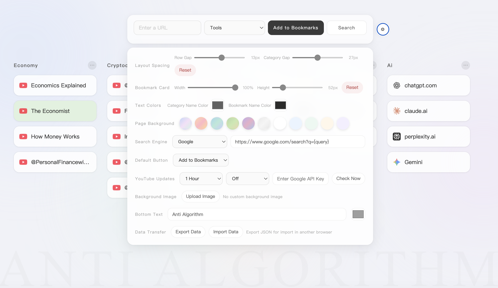

Anti-Algorithm

A personal homepage that keeps the websites and content you actually care about in front of you — instead of letting algorithms decide what you see.

🌐 Live Demo: https://blurfun.github.io/anti-algorithm/

⸻

Why Anti-Algorithm?

I’ve always found it strange that the default homepages of most browsers are either cluttered, unattractive, or simply not very useful.

The truth is, most of us probably visit the same 10–20 websites regularly. For the really frequent ones, we don’t even need bookmarks anymore — type the first letter into the address bar and the browser already knows where we’re going.

So why build another bookmark manager?

Because Anti-Algorithm isn’t really about saving links. It’s about deciding what deserves your attention.

Instead of hiding websites, articles, YouTube channels, research, and things you want to revisit somewhere inside a bookmark folder, Anti-Algorithm puts them directly in front of you.

It’s part bookmark manager, part personal homepage, and part reminder of what you chose to follow.

That’s where the name Anti-Algorithm comes from.

⸻

Features

🔖 Bookmark Management

Add and organise the websites you actually want to keep in sight.

* Add websites directly from the homepage
* Automatically display website favicons
* Automatically generate bookmark names from URLs
* Rename bookmarks
* Delete bookmarks
* Assign bookmarks to categories
* Drag and drop bookmarks to reorder them
* Drag bookmarks between categories
* Give individual bookmark cards different colours
* Open bookmarks in a new tab

⸻

📂 Categories

Organise your homepage around the way you use the web.

You can:

* Create new categories
* Rename categories
* Delete categories
* Drag and drop categories to reorder them
* Move bookmarks between categories

For example:

News · Finance · YouTube · Research · Read Later · Tools

The idea isn’t to build a huge bookmark archive. It’s to keep the things that matter visible.

⸻

🔍 Search

The main input box doubles as a search box, so Anti-Algorithm can also replace the normal browser start page.

Built-in options include:

* Google
* Bing
* Wikipedia
* Custom search engine URLs

You can also choose whether pressing Enter defaults to:

* Add to Bookmarks
* Search

This lets the page work as both a bookmark manager and your everyday browser homepage.

⸻

🎨 Personalisation

Your homepage should look like your homepage.

Anti-Algorithm includes a range of visual customisation options.

Layout

Adjust:

* Bookmark card width
* Bookmark card height
* Row spacing
* Category spacing

Colours

Customise:

* Category text colour
* Bookmark text colour
* Individual bookmark card colours

Background

Choose from built-in themes or upload your own background image.

You can also restore the original theme at any time.

Bottom Text

The large background text at the bottom of the page can also be customised, including:

* Text
* Colour

By default, it reads:

ANTI ALGORITHM

⸻

📺 YouTube Update Checking

Anti-Algorithm can optionally check saved YouTube channels for new content.

When enabled, it can indicate when one of your saved channels has an update, so you can follow the channels you chose rather than relying entirely on YouTube’s recommendation feed.

Options include:

* Check every 30 minutes
* Check every 1 hour
* Check every 3 hours
* Check every 6 hours
* Check content from the last 1–3 days
* Manual Check Now
* Turn update checking off completely

A Google API key can be added in Settings for this feature.

This feature is completely optional.

⸻

💾 Local Storage

One of the design goals of Anti-Algorithm is simplicity.

Your bookmarks are stored locally in your browser.

Anti-Algorithm does not require an account or a backend database to store your bookmark collection.

The browser’s Local Storage is used for:

* Bookmarks
* Categories
* Layout preferences
* Appearance settings
* Search preferences
* YouTube-related settings and cached information

There is no Anti-Algorithm account to create and no bookmark database to maintain on a server.

Note: Because the data is stored in your browser, clearing browser site data may remove your saved information. Use the Export feature to keep a backup.

⸻

🔄 Import & Export

Since your data is stored locally, Anti-Algorithm includes a simple backup and transfer system.

Export

Export your current setup as a JSON file.

The export can include:

* Bookmarks
* Categories
* Page settings
* Layout preferences
* Appearance settings
* YouTube-related information

Import

Import a previously exported JSON file to restore your setup.

This also makes it easy to move your Anti-Algorithm homepage to another browser.

⸻

Getting Started

Anti-Algorithm is intentionally simple.

There is no installation process, account or backend server required.

Option 1 — Use the Live Version

Open:

https://blurfun.github.io/anti-algorithm/

Start adding your own bookmarks and categories.

Option 2 — Run It Locally

Download index.html and open it directly in a modern web browser.

That’s it.

Option 3 — Make It Your Homepage

For the intended experience, set Anti-Algorithm as your browser homepage or startup page.

Then every time you open your browser, the things you chose to see are right in front of you.

⸻

How I Use It

I don’t try to put hundreds of bookmarks into Anti-Algorithm.

That’s not really the point.

I use it for a relatively small number of websites and sources that I actually want to remember to visit — news sources, financial information, YouTube channels, research, tools, and things I want to read later.

Traditional bookmarks are great for storing things.

Anti-Algorithm is for keeping things visible.

⸻

The Idea Behind the Name

The modern web is increasingly organised by recommendation algorithms.

Social networks decide what appears in your feed.

YouTube decides what you should watch next.

News platforms decide which stories deserve your attention.

Search and content platforms increasingly try to predict what you want before you ask for it.

That’s often useful.

But sometimes it’s nice to make the decision yourself.

Anti-Algorithm takes a deliberately simple approach:

You decide what deserves your attention.

Put the websites, people, publications, tools and ideas you care about somewhere you will actually see them.

Not buried in a bookmark folder.

Not selected by an algorithm.

Selected by you.

⸻

Privacy

Anti-Algorithm is designed as a browser-based personal tool.

Your bookmark collection is stored using your browser’s Local Storage rather than in an Anti-Algorithm user account or remote bookmark database.

No registration is required.

If you use optional features that connect to external services, such as YouTube update checking, those services may of course have their own privacy policies and API behaviour.

⸻

Technology

Anti-Algorithm deliberately avoids unnecessary complexity.

It is built with:

* HTML
* CSS
* Vanilla JavaScript
* Browser Local Storage

And uses:

* No JavaScript framework
* No application server
* No user account system
* No backend bookmark database

The entire application lives in a single HTML file.

⸻

Browser Compatibility

Anti-Algorithm is intended for modern desktop browsers.

It should work with current versions of browsers such as:

* Chrome
* Edge
* Firefox
* Safari

Because bookmark data is stored locally, each browser maintains its own copy of the data.

Use Export / Import if you want to move your setup between browsers.

⸻

Backup Recommendation

If you spend time building your personal homepage, periodically use:

Settings → Data Transfer → Export Data

This creates a JSON backup that can later be imported again.

It’s particularly useful before:

* Clearing browser data
* Changing computers
* Changing browsers
* Making major changes to your setup

⸻

Project Philosophy

Anti-Algorithm isn’t trying to replace the entire browser.

And it isn’t trying to become another social feed.

It’s deliberately small.

The goal is simply to create a useful space between you and the web — a homepage containing things you deliberately selected.

Sometimes the best recommendation algorithm is no algorithm at all.

⸻

Live Demo

🌐 https://blurfun.github.io/anti-algorithm/

Source

GitHub:

https://github.com/blurfun/anti-algorithm

⸻

Feedback

This started as a small personal project, but suggestions and feedback are welcome.

If you find a bug or have an idea for something that would make Anti-Algorithm more useful, feel free to open an issue.

⸻

License

No open-source license has been specified yet.
